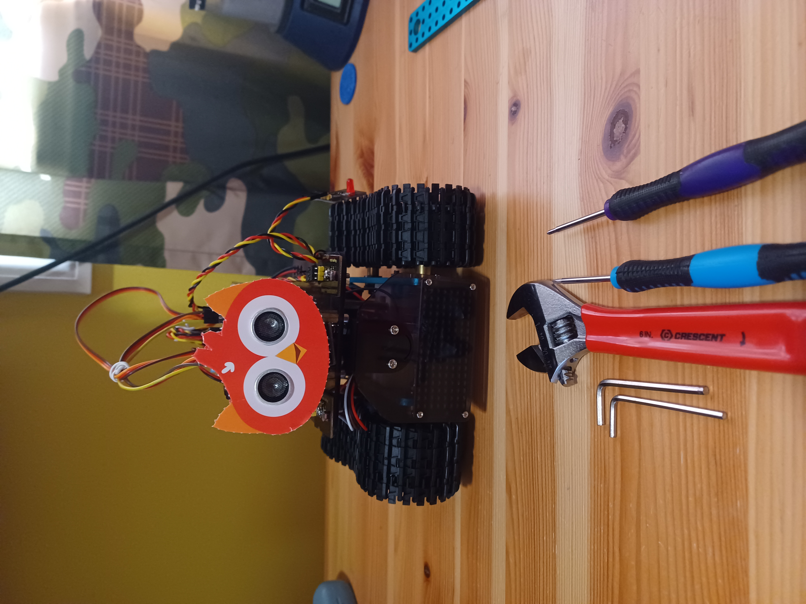
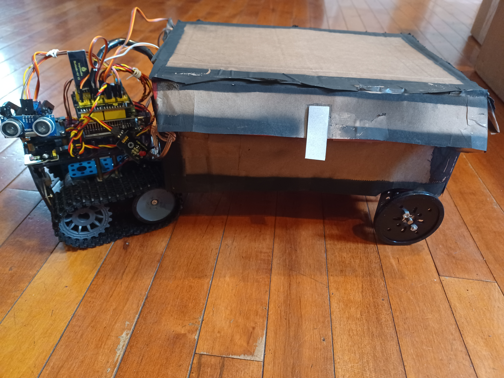

# Mini-Tank Robot
<!--Replace this text with a brief description (2-3 sentences) of your project. This description should draw the reader in and make them interested in what you've built. You can include what the biggest challenges, takeaways, and triumphs from completing the project were. As you complete your portfolio, remember your audience is less familiar than you are with all that your project entails! -->

| **Engineer** | **School** | **Area of Interest** | **Grade** |
|:--:|:--:|:--:|:--:|
| Ezekiel G. | Regis High School | Mechanical engineering/robotics | Rising Sophomore

<!-- **Replace the BlueStamp logo below with an image of yourself and your completed project. Follow the guide [here](https://tomcam.github.io/least-github-pages/adding-images-github-pages-site.html) if you need help.** -->
<div style="text-align: center;">

</div>

# Final Milestone
  My final milestone was adding a trailer that is pulled by the mini-tank and closes in response to an object being placed inside of it. The process started when I simulated the ultrasonic sensor and servo of the box with those of the mini-tank, writing code that used these components as if part of the box so I could start working on it before the parts arrived in the mail.

  While testing the code for the trailer, I noticed that the code would only work while connected to my laptop via usb, this was because I had accidentally short-circuited the Arduino by running a voltage wire through the signal pin of the button to open the box. This short-circuit damaged the Arduino's voltage regulator that provided the Arduino with the necessary 5 volts by controlling the voltage input from the exterior power source (the mini-tank's battery pack), these 5 volts are continuously provided when plugged into the usb port of a computer, explaining why it worked when plugged into my laptop but not while running on power from the battery pack. Unfortunately this also meant that the Arduino I had been using was no longer viable, requiring me to replace it with the Arduino from my personal kit. Further, one of the axles for the trailer did not arrive, meaning I could only install one pair of wheels (which may have been significantly better for turning than two sets of rigid wheels). After this ordeal and some tinkering with the box, I had a fully functional trailer. I adapted to having only one set of wheels by tightening the cables attaching the mini-tank to the trailer so that the front of the trailer was not dragging on the floor.
<div style="text-align: center;">

</div>

The tank towing a prototype trailer


  After the setup was completed I wanted the trailer to look like a double chest from Minecraft, so I covered the box with paper from brown paper bags and cardboard, spraying it with paint afterwards as the finishing touch. During late testing I encountered some more software issues, notably that the code for bluetooth contained the code for the box opening, although there were some more issues with bracket placement. I fixed these software issues by testing out the robot’s functions one-by-one and how the code worked affected it.
<div style="text-align: center;">

</div>

The trailer after being augmented and painted to look like a minecraft chest


 Throughout my time at BlueStamp Engineering I’ve learned more about the arduino language, specifically with how it relates to motors, ultrasonic sensors, and photoresistors. More generally, I’ve gained a deeper understanding of the documentation, design, and testing that’s part of the engineering process. My project has had many issues and damaged hardware, it’s through this that I learned that these things are inevitable in engineering, but all contribute to learning. After the program is finished, I hope to learn more about mechanical engineering and computer science so that I can go more into the field of robotics.
<div style="text-align: center;">

</div>

The final* product


<!--<iframe width="560" height="315" src="https://www.youtube.com/embed/F7M7imOVGug" title="YouTube video player" frameborder="0" allow="accelerometer; autoplay; clipboard-write; encrypted-media; gyroscope; picture-in-picture; web-share" allowfullscreen></iframe> -->

# Second Milestone
<!--For your second milestone, explain what you've worked on since your previous milestone. You can highlight:
- Technical details of what you've accomplished and how they contribute to the final goal
- What has been surprising about the project so far
- Previous challenges you faced that you overcame
- What needs to be completed before your final milestone -->
My second milestone was three-pronged, involving different methods of wireless manual control. I utilized the IR remote included in the robot kit to send signals to the mini-tank's IR reciever, controlling its motors manually from a distance. This method of control, however, has its drawbacks as the reciever requires direct line of sight with the robot to recieve its signals. Further, the distance drop-off in IR signal recievability is immense, meaning that controlling the mini-tank from a distance of just 7 feet while it is facing away from the remote is nearly impossible. A way to get around this issue is with the included bluetooth module, which enables bluetooth control at a range of about 30 feet depending on obstructions.
```c++
  if (irrecv.decode(&results)) {
if(results.value==0xFF629D) {
  digitalWrite(MR_Ctrl, HIGH);
  analogWrite(MR_PWM, 200);
  digitalWrite(ML_Ctrl, HIGH);
  analogWrite(ML_PWM, 200);
  delay(5000);
  analogWrite(MR_PWM, 0);
  analogWrite(ML_PWM, 0);
  delay(100);
}
 irrecv.resume(); //receive the next value
}
```
The code for receiving and acting on the IR signal for moving forward, this prototype stopping after a few seconds of moving

```c++
if (irrecv.decode(&results)) {
if(results.value==0xFF629D) {
  digitalWrite(MR_Ctrl, HIGH);
  analogWrite(MR_PWM, 200);
  digitalWrite(ML_Ctrl, HIGH);
  analogWrite(ML_PWM, 200);
}
 irrecv.resume(); //receive the next value
}
```

I eventually edited it to continuosly move forward until interrupted by another signal


  The most effective way to set up bluetooth control is with the application that Keyestudio developed, Keyes BT Car. Unfortunately, this application is not availabe for Android, the operating system that my phone uses, so I had to find a work-around. Previous instructions in the documentation displayed how to send bluetooth signals from an application called BLE Scanner to the tank's bluetooth module for the purpose of turning an LED on and off, I simply used this method to operate the motors instead, using the signals f, b, l, and r for forward, backward, left, and right respectively. Sending signals via this application is fairly quick, although the turn distance for each signal sent needs to be very short to accomadate minor turns. This method of control is much better than the IR remote, but it still has some inconveniences. However, after I temporarily acquired an iPhone, I downloaded Keyes BT Car and was able to fully control the mini-tank's movements using a controller-like setup. The robot moves in the direction corresponding to the button pressed while it is pressed down and stops as soon as the button is no longer in its pressed state, permitting the tank to make very minor movements easily.
  
```c++
   if (Serial.available())
  {i=Serial.read();
    Serial.println("DATA RECEIVED:");
    if(i=='f')
    { digitalWrite(ML_Ctrl, HIGH);
  analogWrite(ML_PWM, 250);
    digitalWrite(MR_Ctrl, HIGH);
    analogWrite(MR_PWM, 250);
    delay(3500);
analogWrite(ML_PWM, 0);
analogWrite(MR_PWM, 0);
    }}
```

A snippet of code for moving forward on one-letter-signal bluetooth control...


```c++
    if (Serial.available()) {
    bluetooth_val = Serial.read();
    Serial.println(bluetooth_val);
    switch (bluetooth_val) {
      case 'F':  // forward command
        Car_front();
        break;
 ```

 ...Vs moving forward on full bluetooth app control (Car_front is a function specified earlier in the code) </p>
 
    
   Wireless control of the robot is a major accomplishment because it allows a user to maneuver through a store and adapt to different situations, going a long way towards the ultimate goal of remote shopping. In the previous milestone I was forced to remove the bottom plate of the tank due to the lack of m4 nuts, since then I was able to acquire those nuts and reattach it. Before my final milestone, I must have a trailer with a top that that opens and closes with servos in response to objects being placed inside of it. Some other things that would be very helpful towards my final milestone are a camera that enables users to use the robot from afar and an obstacle avoidance system that allows the robot to drive autonomously.
<iframe width="560" height="315" src="https://www.youtube.com/embed/bWixDkv1DTw" title="YouTube video player" frameborder="0" allow="accelerometer; autoplay; clipboard-write; encrypted-media; gyroscope; picture-in-picture; web-share" allowfullscreen></iframe>

# First Milestone
My first milestone was putting together the hardware for my mini-tank and getting its motors to drive the treads. I did this by using the motor shield's screw hubs to set up tank steering with the motors. I've also used the top sensor shield to wire the sensor's servo so that it could be moved. These components are all connected to the Arduino micro-controller which functions as a sort of brain for the robot. There were, however, some hardware issues that slowed my progress. The tank treads were uneven due to one of the plates being angled upwards, requiring me to take apart the chassis to readjust the nuts that keep the brackets in place. This process, while providing extra security, used up the nuts required to keep the bottom plate in place. Additionally, I assumed that the sensor's platform turned 360 degrees, leading me to accidentally break it while moving it out of the way in order to tighten some screws. Once these hardware issues were solved, I had to install a driver for the UART chip on the mini-tank's arduino so that I could upload code to it. For my second milestone I will set up wireless control of the robot's movements and for my final milestone I plan to build a self-closing trailer for my robot to pull behind it.
<div style="text-align: center;">

</div>
<iframe width="560" height="315" src="https://www.youtube.com/embed/b3Cfg2a2Xgo" title="YouTube video player" frameborder="0" allow="accelerometer; autoplay; clipboard-write; encrypted-media; gyroscope; picture-in-picture; web-share" allowfullscreen></iframe>

# Schematics
<div style="text-align: center;">

</div>

# Code
 
```c++
int ledpin=10;
#include <Servo.h>
Servo Box_Lift_R;
int Button_Pin = 1;
int trigPin = 5;    // Trigger
int echoPin = 4;    // Echo
long duration, inches;
int LED = 10;
#define ML_Ctrl 13  //define the direction control pin of left motor
#define ML_PWM 11   //define the PWM control pin of left motor
#define MR_Ctrl 12  //define direction control pin of right motor
#define MR_PWM 3   // define the PWM control pin of right motor
char bluetooth_val;
void Car_front() {
  digitalWrite(MR_Ctrl, HIGH);
  analogWrite(MR_PWM, 200);
  digitalWrite(ML_Ctrl, HIGH);
  analogWrite(ML_PWM, 200);
}

void Car_back() {
  digitalWrite(MR_Ctrl, LOW);
  analogWrite(MR_PWM, 200);
  digitalWrite(ML_Ctrl, LOW);
  analogWrite(ML_PWM, 200);
}

void Car_left() {
  digitalWrite(MR_Ctrl, LOW);
  analogWrite(MR_PWM, 255);
  digitalWrite(ML_Ctrl, HIGH);
  analogWrite(ML_PWM, 255);
}

void Car_right() {
  digitalWrite(MR_Ctrl, HIGH);
  analogWrite(MR_PWM, 255);
  digitalWrite(ML_Ctrl, LOW);
  analogWrite(ML_PWM, 255);
}

void Car_Stop() {
  digitalWrite(MR_Ctrl, LOW);
  analogWrite(MR_PWM, 0);
  digitalWrite(ML_Ctrl, LOW);
  analogWrite(ML_PWM, 0);
}
void setup()
{Serial.begin(9600);
pinMode(ML_Ctrl, OUTPUT);//define direction control pin of left motor as output
  pinMode(ML_PWM, OUTPUT);//define PWM control pin of left motor as output
  pinMode(MR_Ctrl, OUTPUT);//define direction control pin of right motor as output.
  pinMode(MR_PWM, OUTPUT);//define the PWM control pin of right motor as output
  Box_Lift_R.attach(9);
pinMode(Button_Pin, INPUT);
pinMode(trigPin, OUTPUT);
pinMode(echoPin, INPUT);
pinMode(LED, OUTPUT);
Box_Lift_R.write(0);
}
void loop()
{if (Serial.available()) {
    bluetooth_val = Serial.read();
    Serial.println(bluetooth_val);
    switch (bluetooth_val) {
      case 'F':  // forward command
        Car_front();
        break;
      case 'B':  // back command
        Car_back();
        break;
      case 'L':  // left-turning instruction
        Car_left();
        break;
      case 'R':  // right-turning instruction
        Car_right();
        break;
      case 'S':  // stop command
        Car_Stop();
        break;
    }
  }
int i;
  if (Serial.available())
  {i=Serial.read();
    Serial.println("DATA RECEIVED:");
    if(i=='f')
    { digitalWrite(ML_Ctrl, HIGH);
  analogWrite(ML_PWM, 250);
    digitalWrite(MR_Ctrl, HIGH);
    analogWrite(MR_PWM, 250);
    delay(3500);
analogWrite(ML_PWM, 0);
analogWrite(MR_PWM, 0);
    }
    if(i=='b')
    { digitalWrite(ML_Ctrl, LOW);
    analogWrite(ML_PWM, 250);
digitalWrite(MR_Ctrl, LOW);
analogWrite(MR_PWM, 250);
delay(1500);
analogWrite(ML_PWM, 0);
analogWrite(MR_PWM, 0);
    }
if(i=='l')
    { digitalWrite(ML_Ctrl, HIGH);
    analogWrite(ML_PWM, 250);
digitalWrite(MR_Ctrl, LOW);
analogWrite(MR_PWM, 250);
delay(100);
analogWrite(ML_PWM, 0);
analogWrite(MR_PWM, 0);
    }
if(i=='r')
    { digitalWrite(ML_Ctrl, LOW);
    analogWrite(ML_PWM, 250);
digitalWrite(MR_Ctrl, HIGH);
analogWrite(MR_PWM, 250);
delay(100);
analogWrite(ML_PWM, 0);
analogWrite(MR_PWM, 0);
if(i=='fs'){
  digitalWrite(ML_Ctrl, HIGH);
  analogWrite(ML_PWM, 250);
    digitalWrite(MR_Ctrl, HIGH);
    analogWrite(MR_PWM, 250);
    delay(500);
analogWrite(ML_PWM, 0);
analogWrite(MR_PWM, 0);
}
}}
 digitalWrite(trigPin, LOW);
  delayMicroseconds(2);
  digitalWrite(trigPin, HIGH);
  delayMicroseconds(10);
  digitalWrite(trigPin, LOW);
  // Read the signal from the sensor: a HIGH pulse whose
  // duration is the time (in microseconds) from the sending
  // of the ping to the reception of its echo off of an object.
  duration = pulseIn(echoPin, HIGH);
  inches = (duration/2) / 74;   // Divide by 74 or multiply by 0.0135
if(inches <= 7){
 delay(2000);
  Box_Lift_R.write(90);
  digitalWrite(LED, HIGH);
  }
if(digitalRead(Button_Pin) == LOW){
  Box_Lift_R.write(0);
  digitalWrite(LED, LOW);
  delay(1500);
}}//*******************************************
```

# Bill of Materials

| **Part** | **Note** | **Price** | **Link** |
|:--:|:--:|:--:|:--:|
| 2101 Series Stainless Steel D-Shaft (6mm Diameter, 260mm Length) | Used as an axle for each pair of wheels | $12.78 | <a href="https://www.gobilda.com/2101-series-stainless-steel-d-shaft-6mm-diameter-260mm-length/"> GoBilda </a> |
| 1120 Series U-Channel (1 Hole, 48mm Length) | Used to join the box to the wheels | $15.96 | <a href="https://www.gobilda.com/1120-series-u-channel-1-hole-48mm-length/"> GoBilda  </a> |
| 2920 Series Steel Set-Screw Collar (6mm Bore) - 2 Pack | Used to remove any extra sace between the wheels and the U-channel | $9.98 | <a href="https://www.gobilda.com/2920-series-steel-set-screw-collar-6mm-bore-2-pack/"> GoBilda</a> |
| 1309 Series Sonic Hub (6mm D-Bore) | Used to join each wheel to the axle | $27.96 | <a href="https://www.gobilda.com/1309-series-sonic-hub-6mm-d-bore/"> GoBilda </a> |
| 6mm Bore Flat Pillow Block (16mm x 32mm Mounting Pattern) - 2 Pack | Used to hold both axles while allowing them to spin | $15.98 | <a href="https://www.gobilda.com/6mm-bore-flat-pillow-block-16mm-x-32mm-mounting-pattern-2-pack/"> GoBilda </a> |
| 3607 Series Disc Wheel (14mm Bore, 72mm Diameter, Black) - 2 Pack | Used to make it easier for the tank to pull the box behind it | $9.98 | <a href="https://www.gobilda.com/3607-series-disc-wheel-14mm-bore-72mm-diameter-black-2-pack/"> GoBilda </a> |
| WWZMDiB 2Pcs HC-SR04 Ultrasonic Sensor Module for Arduino R3 MEGA Mega2560 Duemilanove Nano Robot XBee ZigBee (2Pcs HC-SR04 with Mounting Bracket) | Used to detect when an object is placed inside of the box | $6.99 | <a href="https://www.amazon.com/WWZMDiB-HC-SR04-Ultrasonic-Distance-Measuring/dp/B0B1MJJLJP/ref=sr_1_1?keywords=Ultrasonic+Sensors&qid=1687457833&sr=8-1"> Amazon </a> |
| 4Pcs SG90 9g Micro Servos for RC Robot Helicopter Airplane Controls Car Boat | Used to open and close the box's lid | $9.16 | <a href="https://www.amazon.com/Micro-Servos-Helicopter-Airplane-Controls/dp/B07MLR1498/ref=sr_1_2?crid=26LBJDE7S5KN1&keywords=servo&qid=1687457909&sprefix=servo%2Caps%2C127&sr=8-2&th=1"> Amazon </a> |
| Cardboard Nike® shoe box | Used as the chassis of the trailer | N/A | N/A |

# Other Resources/Examples

[Documentation/instructions](https://wiki.keyestudio.com/Ks0428_keyestudio_Mini_Tank_Robot_V2#Introduction)
