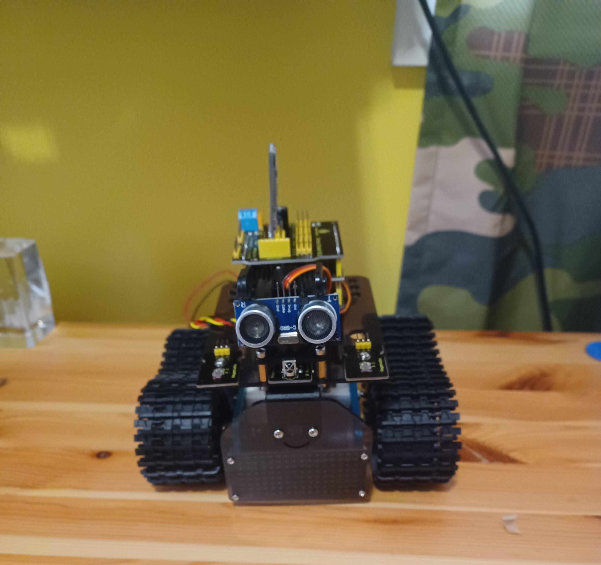

# Mini-Tank Robot
Replace this text with a brief description (2-3 sentences) of your project. This description should draw the reader in and make them interested in what you've built. You can include what the biggest challenges, takeaways, and triumphs from completing the project were. As you complete your portfolio, remember your audience is less familiar than you are with all that your project entails!

| **Engineer** | **School** | **Area of Interest** | **Grade** |
|:--:|:--:|:--:|:--:|
| Ezekiel G. | Regis High School | Mechanical engineering/robotics | Rising Sophomore

**Replace the BlueStamp logo below with an image of yourself and your completed project. Follow the guide [here](https://tomcam.github.io/least-github-pages/adding-images-github-pages-site.html) if you need help.**


  
<!-- # Final Milestone
For your final milestone, explain the outcome of your project. Key details to include are:
- What you've accomplished since your previous milestone
- What your biggest challenges and triumphs were at BSE
- A summary of key topics you learned about
- What you hope to learn in the future after everything you've learned at BSE

**Don't forget to replace the text below with the embedding for your milestone video. Go to Youtube, click Share -> Embed, and copy and paste the code to replace what's below.**

<iframe width="560" height="315" src="https://www.youtube.com/embed/F7M7imOVGug" title="YouTube video player" frameborder="0" allow="accelerometer; autoplay; clipboard-write; encrypted-media; gyroscope; picture-in-picture; web-share" allowfullscreen></iframe> -->

# Second Milestone
For your second milestone, explain what you've worked on since your previous milestone. You can highlight:
- Technical details of what you've accomplished and how they contribute to the final goal
- What has been surprising about the project so far
- Previous challenges you faced that you overcame
- What needs to be completed before your final milestone 
My second milestone was three-pronged, involving different methods of wireless manual control. I utilized the IR remote included in the robot kit to send signals to the mini-tank's IR reciever, controlling its motors manually from a distance. This method of control, however, has its drawbacks as the reciever requires direct line of sight with the robot to recieve its signals. Further, the distance drop-off in IR signal recievability is immense, meaning that controlling the mini-tank from a distance of just 7 feet while it is facing away from the remote is nearly impossible. A way to get around this issue is with the included bluetooth module, which enables bluetooth control at a range of about 30 feet depending on obstructions.
```c++
  if (irrecv.decode(&results)) {
if(results.value==0xFF629D) {
  digitalWrite(MR_Ctrl, HIGH);
  analogWrite(MR_PWM, 200);
  digitalWrite(ML_Ctrl, HIGH);
  analogWrite(ML_PWM, 200);
  delay(5000);
  analogWrite(MR_PWM, 0);
  analogWrite(ML_PWM, 0);
  delay(100);
}
 irrecv.resume(); //receive the next value
}
```
<p>The code for receiving and acting on the IR signal for moving forward, this prototype stopping after a few seconds of moving</p>

```c++
if (irrecv.decode(&results)) {
if(results.value==0xFF629D) {
  digitalWrite(MR_Ctrl, HIGH);
  analogWrite(MR_PWM, 200);
  digitalWrite(ML_Ctrl, HIGH);
  analogWrite(ML_PWM, 200);
}
 irrecv.resume(); //receive the next value
}
```
<p>I eventually edited it to continuosly move forward until interrupted by another signal</p>

  The most effective way to set up bluetooth control is with the application that Keyestudio developed, Keyes BT Car. Unfortunately, this application is not availabe for Android, the operating system that my phone uses, so I was required to find a work-around. Previous instructions in the documentation displayed how to send bluetooth signals from an application called BLE Scanner to the tank's bluetooth module for the purpose of turning an LED on and off, I simply used this method to operate the motors instead, using the signals f, b, l, and r for forward, backward, left, and right respectively. Sending signals via this application is fairly quick, although the turn distance for each signal sent needs to be very short to accomadate minor turns. This method of control is much better than the IR remote, but it still has some inconveniences. However, after I temporarily acquired an iPhone, I downloaded Keyes BT Car and was able to fully control the mini-tank's movements using a controller-like setup. The robot goes forward while the forward button is pressed down and stops as soon as the button is no longer in its pressed state, permitting the tank to make very minor movements easily.
   Wireless control of the robot is a major accomplishment because it allows a user to maneuver through a store and adapt to different situations, going a long way towards the ultimate goal of remote shopping. [What was surprising about my project?] In the previous milestone I was forced to remove the bottom plate of the tank due to the lack of m4 nuts, since then I was able to acquire those nuts and reattach it. Before my final milestone, I must have a trailer with a top that that opens and closes with servos in response to objects being placed inside of it. Some other things that would be very helpful towards my final milestone are a camera that enables users to use the robot from afar and an obstacle avoidance system that allows the robot to drive autonomously.
**Don't forget to replace the text below with the embedding for your milestone video. Go to Youtube, click Share -> Embed, and copy and paste the code to replace what's below.**

<iframe width="560" height="315" src="https://www.youtube.com/embed/y3VAmNlER5Y" title="YouTube video player" frameborder="0" allow="accelerometer; autoplay; clipboard-write; encrypted-media; gyroscope; picture-in-picture; web-share" allowfullscreen></iframe>

# First Milestone
My first milestone was putting together the hardware for my mini-tank and getting its motors to drive the treads. I did this by using the motor shield's screw hubs to set up tank steering with the motors. I've also used the top sensor shield to wire the sensor's servo so that it could be moved. These components are all connected to the Arduino micro-controller which functions as a sort of brain for the robot. There were, however, some hardware issues that slowed my progress. The tank treads were uneven due to one of the plates being angled upwards, requiring me to take apart the chassis to readjust the nuts that keep the brackets in place. This process, while providing extra security, used up the nuts required to keep the bottom plate in place. Additionally, I assumed that the sensor's platform turned 360 degrees, leading me to accidentally break it while moving it out of the way in order to tighten some screws. Once these hardware issues were solved, I had to install a driver for the UART chip on the mini-tank's arduino so that I could upload code to it. For my second milestone I will set up wireless control of the robot's movements and for my final milestone I plan to build a self-closing trailer for my robot to pull behind it.
<div style="text-align: center;">

</div>
<p>The tank</p>

**Don't forget to replace the text below with the embedding for your milestone video. Go to Youtube, click Share -> Embed, and copy and paste the code to replace what's below.**

<iframe width="560" height="315" src="https://www.youtube.com/embed/CaCazFBhYKs" title="YouTube video player" frameborder="0" allow="accelerometer; autoplay; clipboard-write; encrypted-media; gyroscope; picture-in-picture; web-share" allowfullscreen></iframe>

  <!-- # Schematics 
Here's where you'll put images of your schematics. [Tinkercad](https://www.tinkercad.com/blog/official-guide-to-tinkercad-circuits) and [Fritzing](https://fritzing.org/learning/) are both great resoruces to create professional schematic diagrams, though BSE recommends Tinkercad becuase it can be done easily and for free in the browser. 

# Code
Here's where you'll put your code. The syntax below places it into a block of code. Follow the guide [here]([url](https://www.markdownguide.org/extended-syntax/)) to learn how to customize it to your project needs. 

```c++
void setup() {
  // put your setup code here, to run once:
  Serial.begin(9600);
  Serial.println("Hello World!");
}

void loop() {
  // put your main code here, to run repeatedly:

}
```
-->
# Bill of Materials
Here's where you'll list the parts in your project. To add more rows, just copy and paste the example rows below.
Don't forget to place the link of where to buy each component inside the quotation marks in the corresponding row after href =. Follow the guide [here]([url](https://www.markdownguide.org/extended-syntax/)) to learn how to customize this to your project needs. 

| **Part** | **Note** | **Price** | **Link** |
|:--:|:--:|:--:|:--:|
| 2101 Series Stainless Steel D-Shaft (6mm Diameter, 260mm Length) | Used as an axle for each pair of wheels | $12.78 | <a href="https://www.gobilda.com/2101-series-stainless-steel-d-shaft-6mm-diameter-260mm-length/"> https://www.gobilda.com/2101-series-stainless-steel-d-shaft-6mm-diameter-260mm-length/ </a> |
|:--:|:--:|:--:|:--:|
| 1120 Series U-Channel (1 Hole, 48mm Length) | Used to join the box to the wheels | $15.96 | <a href="https://www.amazon.com/Arduino-A000066-ARDUINO-UNO-R3/dp/B008GRTSV6/"> https://www.gobilda.com/1120-series-u-channel-1-hole-48mm-length/  </a> |
|:--:|:--:|:--:|:--:|
| 2920 Series Steel Set-Screw Collar (6mm Bore) - 2 Pack | Used to remove any extra sace between the wheels and the U-channel | $9.98 | <a href="https://www.amazon.com/Arduino-A000066-ARDUINO-UNO-R3/dp/B008GRTSV6/"> https://www.gobilda.com/2920-series-steel-set-screw-collar-6mm-bore-2-pack/ </a> |
|:--:|:--:|:--:|:--:|
| 1309 Series Sonic Hub (6mm D-Bore) | Used to join each wheel to the axle | $27.96 | <a href="https://www.amazon.com/Arduino-A000066-ARDUINO-UNO-R3/dp/B008GRTSV6/"> https://www.gobilda.com/2920-series-steel-set-screw-collar-6mm-bore-2-pack/ </a> |
|:--:|:--:|:--:|:--:|
| 6mm Bore Flat Pillow Block (16mm x 32mm Mounting Pattern) - 2 Pack | Used to hold both axles while allowing them to spin | $15.98 | <a href="https://www.amazon.com/Arduino-A000066-ARDUINO-UNO-R3/dp/B008GRTSV6/"> https://www.gobilda.com/6mm-bore-flat-pillow-block-16mm-x-32mm-mounting-pattern-2-pack/ </a> |
|:--:|:--:|:--:|:--:|
| 3607 Series Disc Wheel (14mm Bore, 72mm Diameter, Black) - 2 Pack | Used to make it easier for the tank to pull the box behind it | $9.98 | <a href="https://www.amazon.com/Arduino-A000066-ARDUINO-UNO-R3/dp/B008GRTSV6/"> https://www.gobilda.com/3607-series-disc-wheel-14mm-bore-72mm-diameter-black-2-pack/ </a> |
|:--:|:--:|:--:|:--:|
| WWZMDiB 2Pcs HC-SR04 Ultrasonic Sensor Module for Arduino R3 MEGA Mega2560 Duemilanove Nano Robot XBee ZigBee (2Pcs HC-SR04 with Mounting Bracket) | Used to detect when an object is placed inside of the box | $6.99 | <a href="https://www.amazon.com/Arduino-A000066-ARDUINO-UNO-R3/dp/B008GRTSV6/"> https://www.amazon.com/WWZMDiB-HC-SR04-Ultrasonic-Distance-Measuring/dp/B0B1MJJLJP/ref=sr_1_1?keywords=Ultrasonic+Sensors&qid=1687457833&sr=8-1 x1 
 </a> |
|:--:|:--:|:--:|:--:|
| 4Pcs SG90 9g Micro Servos for RC Robot Helicopter Airplane Controls Car Boat | Used to open and close the box's lid | $9.16 | <a href="https://www.amazon.com/Arduino-A000066-ARDUINO-UNO-R3/dp/B008GRTSV6/"> https://www.amazon.com/Micro-Servos-Helicopter-Airplane-Controls/dp/B07MLR1498/ref=sr_1_2?crid=26LBJDE7S5KN1&keywords=servo&qid=1687457909&sprefix=servo%2Caps%2C127&sr=8-2&th=1
 </a> |
|:--:|:--:|:--:|:--:|
| Cardboard Nike® shoe box | Used as the chassis of the trailer | N/A | N/A |
|:--:|:--:|:--:|:--:|
# Other Resources/Examples
One of the best parts about Github is that you can view how other people set up their own work. Here are some past BSE portfolios that are awesome examples. You can view how they set up their portfolio, and you can view their index.md files to understand how they implemented different portfolio components.
- [Example 1](https://trashytuber.github.io/YimingJiaBlueStamp/)
- [Example 2](https://sviatil0.github.io/Sviatoslav_BSE/)
- [Example 3](https://arneshkumar.github.io/arneshbluestamp/)

To watch the BSE tutorial on how to create a portfolio, click here.
